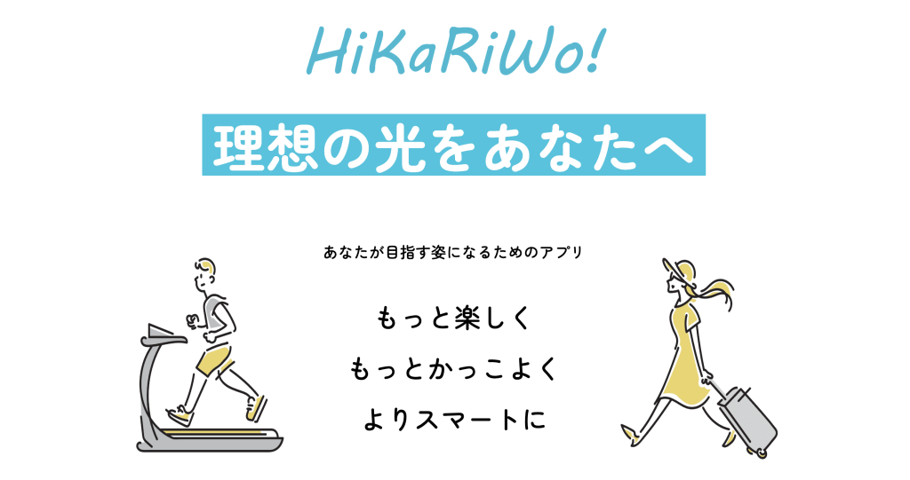

# HiKaRiWo LP（TECJUM teamE）

> KADOKAWAドワンゴ情報工科学院内、冬の開発イベント『Tech Jum』<br>
> サントリーグローバルイノベーションセンター様との産学連携でのチーム制作


---

## 📌 概要

サントリーグローバルイノベーションセンター（GIC）様との産学連携プロジェクトとして、
チームで企画・制作したWebシステム／ランディングページです。
要件定義から設計・実装・リリースまでのフルサイクルをチームで担当しました。

---

## 📸 スクリーンショット

<div align="center">

</div>

---

## 🛠️ 技術スタック

| カテゴリ | 使用技術 |
|---|---|
| バックエンド | Python / Django |
| データベース | MySQL |
| フロントエンド | HTML / CSS / JavaScript |
| インフラ | Docker / Docker Compose |

---

## 👥 チームメンバー

| 役割 | メンバー |
|---|---|
| **プロジェクトリーダー** | 赤堀匠海 |
| フロントエンド | 鈴木至恩 / 赤堀匠海 |
| バックエンド | 桑野樹希 / 中西拳也 |
| プレゼンテーション | 長田絹人 |

---

## 🚀 ローカル環境構築

```bash
git clone https://github.com/Akasan-T/TECJUM-teamE_hikariwo.git
cd TECJUM-teamE_hikariwo
docker-compose up
```
